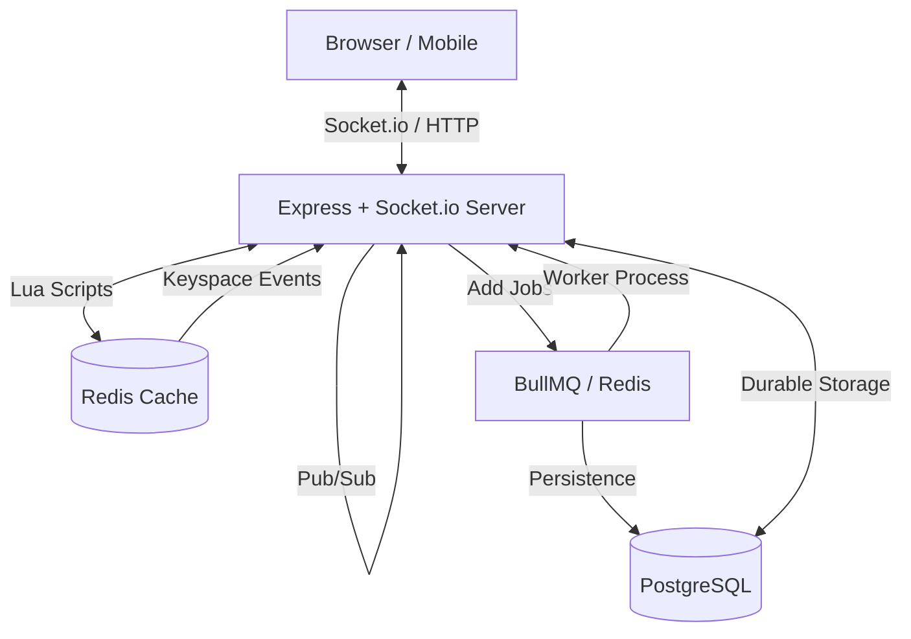

# Live Bidding Platform

A real-time auction system built with Node.js, Express, Socket.io, and React. This platform allows users to engage in live bidding with real-time updates and synchronization.

## 🚀 Live Demo
- **Frontend**: [https://live-bidding-platform-1-frontend.onrender.com](https://live-bidding-platform-1-frontend.onrender.com)
- **Backend API**: [https://live-bidding-platform-j369.onrender.com](https://live-bidding-platform-j369.onrender.com)


{"type":"excalidraw/clipboard","workspaceId":"Hiux2HbzXZqRoo29o78F","elements":[{"renderVersion":"20260129","strokeColor":"#1c1c1c","fillStyle":"solid","backgroundColor":"transparent","strokeWidth":1,"strokeStyle":"solid","roughness":0,"opacity":100,"strokeSharpness":"sharp","version":19,"isDeleted":false,"x":-667.2421875,"y":-281,"diagramType":"flowchart-diagram","lastEditMode":"ai","forceAiMode":false,"code":"title Real Time Auction Platform Architecture\ndirection right\n\n// Client Layer\nClient [shape: oval, icon: smartphone, color: lightblue]\n\n// API Server Layer\nAPI Server [icon: server, color: blue]\n\n// In Memory Storage\nRedis Layer [color: orange, icon: database] {\n  Redis Cache [icon: zap, color: orange]\n  Lua Scripts [icon: code, color: orange]\n}\n\n// Background Processing\nBackground Processing [color: purple, icon: cpu] {\n  Job Queue [icon: list, color: purple]\n  Worker Process [icon: settings, color: purple]\n}\n\n// Durable Storage\nPostgreSQL Database [icon: database, color: green]\n\n// Relationships\nClient <> API Server: Socket.io or HTTP [color: blue]\nAPI Server <> Redis Cache: Read or Write State [color: orange]\nAPI Server > Lua Scripts: Atomic Bid Validation [color: orange]\nLua Scripts > Redis Cache: Execute [color: orange]\nAPI Server <> API Server: Pub or Sub Broadcast [color: blue]\nAPI Server > Job Queue: Add Jobs [color: purple]\nJob Queue > Worker Process: Process Jobs [color: purple]\nWorker Process > PostgreSQL Database: Persist Data [color: green]\nAPI Server <> PostgreSQL Database: Durable Storage [color: green]\nAPI Server < Redis Cache: Keyspace Events","scale":1,"id":"NwUgHBCfeqLqOo1xqhS5y","type":"diagram","width":1476.3096618652344,"height":407,"angle":0,"groupIds":[],"lockedGroupId":null,"seed":979859191,"modifiedAt":1769666825020,"zIndex":0,"isBeingGenerated":false,"isSyntaxMissing":false,"isSyntaxBroken":false},{"id":"ff4d8e87d209e69c0048780da1b4ff7f","strokeColor":"#c38424","backgroundColor":"rgba(253,251,246, 1)","fillStyle":"solid","strokeWidth":0.75,"strokeStyle":"solid","strokeSharpness":"round","roughness":0,"opacity":100,"elementStyle":1,"colorMode":0,"diagramId":"NwUgHBCfeqLqOo1xqhS5y","diagramEntityId":"Redis Layer","type":"rectangle","isContainer":true,"diagramRole":"group","sizingMode":"auto","compound":{"type":"parent","containerType":"group","settings":{"color":"orange","colorMode":"pastel","styleMode":"shadow","typeface":"rough"},"children":{"label":"REDIS LAYER","icon":{"name":"database"}}},"x":10.01361083984375,"y":-266,"width":490.4719696044922,"height":168,"angle":0,"groupIds":[],"lockedGroupId":null,"seed":823813847,"version":8,"isDeleted":false,"modifiedAt":1769666825020,"zIndex":1},{"id":"33c253d401d167f542a4ed326d458128","type":"rectangle","containerId":"ff4d8e87d209e69c0048780da1b4ff7f","diagramId":"NwUgHBCfeqLqOo1xqhS5y","diagramEntityId":"Redis Cache","diagramRole":"node","strokeColor":"#242424","backgroundColor":"#f8d8c0","fillStyle":"solid","strokeWidth":0.75,"strokeStyle":"solid","strokeSharpness":[6,6,6,6],"roughness":0,"opacity":100,"elementStyle":1,"colorMode":0,"x":310.48558044433594,"y":-201,"sizingMode":"auto","compound":{"type":"parent","containerType":"flow-node","settings":{"shape":"rectangle","color":"orange","colorMode":"pastel","styleMode":"shadow","typeface":"rough"},"children":{"label":"Redis Cache","icon":{"name":"zap"}}},"width":138,"height":72,"angle":0,"groupIds":[],"lockedGroupId":null,"seed":1209058135,"version":8,"isDeleted":false,"modifiedAt":1769666825020,"zIndex":2},{"id":"990d7c32285aa7cd3be88811ad837b2d","type":"rectangle","containerId":"ff4d8e87d209e69c0048780da1b4ff7f","diagramId":"NwUgHBCfeqLqOo1xqhS5y","diagramEntityId":"Lua Scripts","diagramRole":"node","strokeColor":"#242424","backgroundColor":"#f8d8c0","fillStyle":"solid","strokeWidth":0.75,"strokeStyle":"solid","strokeSharpness":[6,6,6,6],"roughness":0,"opacity":100,"elementStyle":1,"colorMode":0,"x":47.01361083984375,"y":-201,"sizingMode":"auto","compound":{"type":"parent","containerType":"flow-node","settings":{"shape":"rectangle","color":"orange","colorMode":"pastel","styleMode":"shadow","typeface":"rough"},"children":{"label":"Lua Scripts","icon":{"name":"code"}}},"width":138,"height":72,"angle":0,"groupIds":[],"lockedGroupId":null,"seed":1771772311,"version":8,"isDeleted":false,"modifiedAt":1769666825020,"zIndex":3},{"id":"a6a671a3f35efa79a01eabbee0062fcf","type":"arrow","diagramId":"NwUgHBCfeqLqOo1xqhS5y","diagramEntityId":"rel-Lua Scripts-Redis Cache-forward-Execute","strokeColor":"orange","backgroundColor":"transparent","fillStyle":"solid","strokeWidth":0.75,"strokeStyle":"solid","strokeSharpness":"elbow","roughness":0,"opacity":100,"arrowHeadSize":12,"shouldApplyRoughness":true,"startArrowhead":null,"endArrowhead":"arrow","cardinalElbowData":{"isEnabled":true},"points":[[0,0],[125,0]],"x":185.01361083984375,"y":-165,"diagramCodeElement":{"from":"Lua Scripts","to":"Redis Cache","relationshipType":"FORWARD","label":"Execute"},"lastCommittedPoint":null,"startBinding":{"elementId":"990d7c32285aa7cd3be88811ad837b2d","bindingType":"portOrCenter","portLocationOptions":{"portLocation":"fixed.CustomPort","relativeOffset":[1,0],"direction":"right"}},"endBinding":{"elementId":"33c253d401d167f542a4ed326d458128","bindingType":"portOrCenter","portLocationOptions":{"portLocation":"fixed.CustomPort","relativeOffset":[-1.006840139195539,0],"direction":"left"}},"width":125,"height":0,"angle":0,"groupIds":["73d984ab17d9cbd80d9922a5762c5f2f"],"lockedGroupId":"73d984ab17d9cbd80d9922a5762c5f2f","seed":1237929751,"version":8,"isDeleted":false,"textGap":[41.498483657836914,-10,47.47500228881836,19],"modifiedAt":1769666825020,"zIndex":4},{"strokeColor":"#000000","backgroundColor":"transparent","fillStyle":"solid","strokeWidth":0.75,"strokeStyle":"solid","strokeSharpness":"sharp","roughness":0,"opacity":100,"scale":1,"fontSize":14,"fontFamily":2,"textAlign":"center","verticalAlign":"middle","id":"f4e4cc121b1f182c199aeb1293aed4bc","diagramId":"NwUgHBCfeqLqOo1xqhS5y","diagramEntityId":"rel-Lua Scripts-Redis Cache-forward-Execute","x":227.51209449768066,"y":-174,"text":"Execute","type":"textbox","width":45.47500228881836,"height":17,"angle":0,"groupIds":["73d984ab17d9cbd80d9922a5762c5f2f"],"lockedGroupId":"73d984ab17d9cbd80d9922a5762c5f2f","seed":227021273,"version":9,"isDeleted":false,"mode":"normal","hasFixedBounds":true,"modifiedAt":1769666825020,"zIndex":5},{"id":"79b41a84157e606e31d8eb9222512117","strokeColor":"#c43dcf","backgroundColor":"rgba(252,247,253, 1)","fillStyle":"solid","strokeWidth":0.75,"strokeStyle":"solid","strokeSharpness":"round","roughness":0,"opacity":100,"elementStyle":1,"colorMode":0,"diagramId":"NwUgHBCfeqLqOo1xqhS5y","diagramEntityId":"Background Processing","type":"rectangle","isContainer":true,"diagramRole":"group","sizingMode":"auto","compound":{"type":"parent","containerType":"group","settings":{"color":"purple","colorMode":"pastel","styleMode":"shadow","typeface":"rough"},"children":{"label":"BACKGROUND PROCESSING","icon":{"name":"cpu"}}},"x":10.01361083984375,"y":-73,"width":511.43994140625,"height":141,"angle":0,"groupIds":[],"lockedGroupId":null,"seed":405921047,"version":7,"isDeleted":false,"modifiedAt":1769666825020,"zIndex":6},{"id":"fd9d9216baafdb2cb8b0d9c729f469d4","type":"rectangle","containerId":"79b41a84157e606e31d8eb9222512117","diagramId":"NwUgHBCfeqLqOo1xqhS5y","diagramEntityId":"Job Queue","diagramRole":"node","strokeColor":"#242424","backgroundColor":"#f4c0f8","fillStyle":"solid","strokeWidth":0.75,"strokeStyle":"solid","strokeSharpness":[6,6,6,6],"roughness":0,"opacity":100,"elementStyle":1,"colorMode":0,"x":47.01361083984375,"y":-24,"sizingMode":"auto","compound":{"type":"parent","containerType":"flow-node","settings":{"shape":"rectangle","color":"purple","colorMode":"pastel","styleMode":"shadow","typeface":"rough"},"children":{"label":"Job Queue","icon":{"name":"list"}}},"width":138,"height":72,"angle":0,"groupIds":[],"lockedGroupId":null,"seed":1018486743,"version":7,"isDeleted":false,"modifiedAt":1769666825020,"zIndex":7},{"id":"befef76a4e32080ad3664acaa092f816","type":"rectangle","containerId":"79b41a84157e606e31d8eb9222512117","diagramId":"NwUgHBCfeqLqOo1xqhS5y","diagramEntityId":"Worker Process","diagramRole":"node","strokeColor":"#242424","backgroundColor":"#f4c0f8","fillStyle":"solid","strokeWidth":0.75,"strokeStyle":"solid","strokeSharpness":[6,6,6,6],"roughness":0,"opacity":100,"elementStyle":1,"colorMode":0,"x":326.45355224609375,"y":-24,"sizingMode":"auto","compound":{"type":"parent","containerType":"flow-node","settings":{"shape":"rectangle","color":"purple","colorMode":"pastel","styleMode":"shadow","typeface":"rough"},"children":{"label":"Worker Process","icon":{"name":"settings"}}},"width":138,"height":72,"angle":0,"groupIds":[],"lockedGroupId":null,"seed":1480726039,"version":7,"isDeleted":false,"modifiedAt":1769666825020,"zIndex":8},{"id":"5b17239117ac8768edf7a67117d22891","type":"arrow","diagramId":"NwUgHBCfeqLqOo1xqhS5y","diagramEntityId":"rel-Job Queue-Worker Process-forward-Process Jobs","strokeColor":"purple","backgroundColor":"transparent","fillStyle":"solid","strokeWidth":0.75,"strokeStyle":"solid","strokeSharpness":"elbow","roughness":0,"opacity":100,"arrowHeadSize":12,"shouldApplyRoughness":true,"startArrowhead":null,"endArrowhead":"arrow","cardinalElbowData":{"isEnabled":true},"points":[[0,0],[141,0]],"x":185.01361083984375,"y":12,"diagramCodeElement":{"from":"Job Queue","to":"Worker Process","relationshipType":"FORWARD","label":"Process Jobs"},"lastCommittedPoint":null,"startBinding":{"elementId":"fd9d9216baafdb2cb8b0d9c729f469d4","bindingType":"portOrCenter","portLocationOptions":{"portLocation":"fixed.CustomPort","relativeOffset":[1,0],"direction":"right"}},"endBinding":{"elementId":"befef76a4e32080ad3664acaa092f816","bindingType":"portOrCenter","portLocationOptions":{"portLocation":"fixed.CustomPort","relativeOffset":[-1.0063759624094204,0],"direction":"left"}},"width":141,"height":0,"angle":0,"groupIds":["bbb610d883f6c4c345c02d5e2962121d"],"lockedGroupId":"bbb610d883f6c4c345c02d5e2962121d","seed":2082296887,"version":6,"isDeleted":false,"textGap":[41.49496841430664,-10,78.45000457763672,19],"modifiedAt":1769666825020,"zIndex":9},{"strokeColor":"#000000","backgroundColor":"transparent","fillStyle":"solid","strokeWidth":0.75,"strokeStyle":"solid","strokeSharpness":"sharp","roughness":0,"opacity":100,"scale":1,"fontSize":14,"fontFamily":2,"textAlign":"center","verticalAlign":"middle","id":"c134c719b36440faa60221c2e60d8308","diagramId":"NwUgHBCfeqLqOo1xqhS5y","diagramEntityId":"rel-Job Queue-Worker Process-forward-Process Jobs","x":227.5085792541504,"y":3,"text":"Process Jobs","type":"textbox","width":76.45000457763672,"height":17,"angle":0,"groupIds":["bbb610d883f6c4c345c02d5e2962121d"],"lockedGroupId":"bbb610d883f6c4c345c02d5e2962121d","seed":1580887737,"version":7,"isDeleted":false,"mode":"normal","hasFixedBounds":true,"modifiedAt":1769666825020,"zIndex":10},{"id":"3f0bace26e8785bad891c8566ac376e4","type":"oval","diagramId":"NwUgHBCfeqLqOo1xqhS5y","diagramEntityId":"Client","diagramRole":"node","strokeColor":"#242424","backgroundColor":"lightblue","fillStyle":"solid","strokeWidth":0.75,"strokeStyle":"solid","strokeSharpness":"round","roughness":0,"opacity":100,"elementStyle":1,"colorMode":0,"x":-652.2421875,"y":-146.25,"sizingMode":"auto","compound":{"type":"parent","containerType":"flow-node","settings":{"shape":"oval","color":"lightblue","colorMode":"pastel","styleMode":"shadow","typeface":"rough"},"children":{"label":"Client","icon":{"name":"smartphone"}}},"width":138,"height":72,"angle":0,"groupIds":[],"lockedGroupId":null,"seed":1780923479,"version":8,"isDeleted":false,"modifiedAt":1769666825020,"zIndex":11},{"id":"1598da3b2ecb2cfc0ad641c8e0728275","type":"rectangle","diagramId":"NwUgHBCfeqLqOo1xqhS5y","diagramEntityId":"API Server","diagramRole":"node","strokeColor":"#242424","backgroundColor":"#c7dcfc","fillStyle":"solid","strokeWidth":0.75,"strokeStyle":"solid","strokeSharpness":[6,6,6,6],"roughness":0,"opacity":100,"elementStyle":1,"colorMode":0,"x":-345.9363098144531,"y":-146.25,"sizingMode":"auto","compound":{"type":"parent","containerType":"flow-node","settings":{"shape":"rectangle","color":"blue","colorMode":"pastel","styleMode":"shadow","typeface":"rough"},"children":{"label":"API Server","icon":{"name":"server"}}},"width":138,"height":72,"angle":0,"groupIds":[],"lockedGroupId":null,"seed":2001130135,"version":8,"isDeleted":false,"modifiedAt":1769666825020,"zIndex":12},{"id":"f1f044c481c0371a69cbbfa4fa4556e8","type":"arrow","diagramId":"NwUgHBCfeqLqOo1xqhS5y","diagramEntityId":"rel-API Server-API Server-bidirectional-Pub or Sub Broadcast","strokeColor":"blue","backgroundColor":"transparent","fillStyle":"solid","strokeWidth":0.75,"strokeStyle":"solid","strokeSharpness":"elbow","roughness":0,"opacity":100,"arrowHeadSize":12,"shouldApplyRoughness":true,"startArrowhead":"arrow","endArrowhead":"arrow","cardinalElbowData":{"isEnabled":true},"points":[[0,0],[0,-10],[46,-10],[46,0]],"x":-299.9363098144531,"y":-146.25,"diagramCodeElement":{"from":"API Server","to":"API Server","relationshipType":"BIDIRECTIONAL","label":"Pub or Sub Broadcast"},"lastCommittedPoint":null,"startBinding":{"elementId":"1598da3b2ecb2cfc0ad641c8e0728275","bindingType":"portOrCenter","portLocationOptions":{"portLocation":"fixed.CustomPort","relativeOffset":[-0.3333333333333333,-1],"direction":"up"}},"endBinding":{"elementId":"1598da3b2ecb2cfc0ad641c8e0728275","bindingType":"portOrCenter","portLocationOptions":{"portLocation":"fixed.CustomPort","relativeOffset":[0.3333333333333333,-1],"direction":"up"}},"width":46,"height":10,"angle":0,"groupIds":["538851a2e1b12fafd056fa11ccd75f57"],"lockedGroupId":"538851a2e1b12fafd056fa11ccd75f57","seed":200521047,"version":7,"isDeleted":false,"textGap":[-12.868751525878906,-47.5,71.73750305175781,33],"modifiedAt":1769666825020,"zIndex":13},{"strokeColor":"#000000","backgroundColor":"transparent","fillStyle":"solid","strokeWidth":0.75,"strokeStyle":"solid","strokeSharpness":"sharp","roughness":0,"opacity":100,"scale":1,"fontSize":14,"fontFamily":2,"textAlign":"center","verticalAlign":"middle","id":"9a8e49f5dde2a151b5c0c7111fa5a56d","diagramId":"NwUgHBCfeqLqOo1xqhS5y","diagramEntityId":"rel-API Server-API Server-bidirectional-Pub or Sub Broadcast","x":-311.80506134033203,"y":-192.75,"text":"Pub or Sub Broadcast","type":"textbox","width":69.73750305175781,"height":31,"angle":0,"groupIds":["538851a2e1b12fafd056fa11ccd75f57"],"lockedGroupId":"538851a2e1b12fafd056fa11ccd75f57","seed":642658201,"version":8,"isDeleted":false,"mode":"normal","hasFixedBounds":true,"modifiedAt":1769666825020,"zIndex":14},{"id":"b495fdff29e7c4f4612ac263a0dc6a4f","type":"arrow","diagramId":"NwUgHBCfeqLqOo1xqhS5y","diagramEntityId":"rel-Client-API Server-bidirectional-Socket.io or HTTP","strokeColor":"blue","backgroundColor":"transparent","fillStyle":"solid","strokeWidth":0.75,"strokeStyle":"solid","strokeSharpness":"elbow","roughness":0,"opacity":100,"arrowHeadSize":12,"shouldApplyRoughness":true,"startArrowhead":"arrow","endArrowhead":"arrow","cardinalElbowData":{"isEnabled":true},"points":[[0,0],[164.38848638119688,0]],"x":-512.32479619565,"y":-110.25,"diagramCodeElement":{"from":"Client","to":"API Server","relationshipType":"BIDIRECTIONAL","label":"Socket.io or HTTP"},"lastCommittedPoint":null,"startBinding":{"elementId":"3f0bace26e8785bad891c8566ac376e4","bindingType":"portOrCenter","portLocationOptions":{"portLocation":"fixed.CustomPort","relativeOffset":[1.0277882797731883,0],"direction":"right"}},"endBinding":{"elementId":"1598da3b2ecb2cfc0ad641c8e0728275","bindingType":"portOrCenter","portLocationOptions":{"portLocation":"fixed.CustomPort","relativeOffset":[-1.0289855072463767,0],"direction":"left"}},"width":164.38848638119688,"height":0,"angle":0,"groupIds":["e1556d18cac08cb75289e328cc785380"],"lockedGroupId":"e1556d18cac08cb75289e328cc785380","seed":1352725111,"version":8,"isDeleted":false,"textGap":[41.23554753842345,-17,102,33],"modifiedAt":1769666825020,"zIndex":15},{"strokeColor":"#000000","backgroundColor":"transparent","fillStyle":"solid","strokeWidth":0.75,"strokeStyle":"solid","strokeSharpness":"sharp","roughness":0,"opacity":100,"scale":1,"fontSize":14,"fontFamily":2,"textAlign":"center","verticalAlign":"middle","id":"781ceac4edf19cac6e65ea60a73876a9","diagramId":"NwUgHBCfeqLqOo1xqhS5y","diagramEntityId":"rel-Client-API Server-bidirectional-Socket.io or HTTP","x":-470.08924865722656,"y":-126.25,"text":"Socket.io or HTTP","type":"textbox","width":100,"height":31,"angle":0,"groupIds":["e1556d18cac08cb75289e328cc785380"],"lockedGroupId":"e1556d18cac08cb75289e328cc785380","seed":1006031993,"version":9,"isDeleted":false,"mode":"normal","hasFixedBounds":true,"modifiedAt":1769666825020,"zIndex":16},{"id":"62c9234d10dae869910ab998adba8b6b","type":"arrow","diagramId":"NwUgHBCfeqLqOo1xqhS5y","diagramEntityId":"rel-API Server-Redis Cache-bidirectional-Read or Write State","strokeColor":"orange","backgroundColor":"transparent","fillStyle":"solid","strokeWidth":0.75,"strokeStyle":"solid","strokeSharpness":"elbow","roughness":0,"opacity":100,"arrowHeadSize":12,"shouldApplyRoughness":true,"startArrowhead":"arrow","endArrowhead":"arrow","cardinalElbowData":{"isEnabled":true},"points":[[0,0],[47,0],[47,-84],[185,-84],[185,-78],[491,-78],[491,-49],[518,-49]],"x":-207.93630981445312,"y":-134.25,"diagramCodeElement":{"from":"API Server","to":"Redis Cache","relationshipType":"BIDIRECTIONAL","label":"Read or Write State"},"lastCommittedPoint":null,"startBinding":{"elementId":"1598da3b2ecb2cfc0ad641c8e0728275","bindingType":"portOrCenter","portLocationOptions":{"portLocation":"fixed.CustomPort","relativeOffset":[1,-0.6666666666666666],"direction":"right"}},"endBinding":{"elementId":"33c253d401d167f542a4ed326d458128","bindingType":"portOrCenter","portLocationOptions":{"portLocation":"fixed.CustomPort","relativeOffset":[-1.006114351576653,-0.5069444444444444],"direction":"left"}},"width":518,"height":84,"angle":0,"groupIds":["8ccde8b67f4ea0764fa7287aa269c26b"],"lockedGroupId":"8ccde8b67f4ea0764fa7287aa269c26b","seed":1122601879,"version":8,"isDeleted":false,"textGap":[83.09996032714844,-101.25,85.75,33],"modifiedAt":1769666825020,"zIndex":17},{"strokeColor":"#000000","backgroundColor":"transparent","fillStyle":"solid","strokeWidth":0.75,"strokeStyle":"solid","strokeSharpness":"sharp","roughness":0,"opacity":100,"scale":1,"fontSize":14,"fontFamily":2,"textAlign":"center","verticalAlign":"middle","id":"67b6ed45233a324dbbc3688b19f3b956","diagramId":"NwUgHBCfeqLqOo1xqhS5y","diagramEntityId":"rel-API Server-Redis Cache-bidirectional-Read or Write State","x":-123.83634948730469,"y":-234.5,"text":"Read or Write State","type":"textbox","width":83.75,"height":31,"angle":0,"groupIds":["8ccde8b67f4ea0764fa7287aa269c26b"],"lockedGroupId":"8ccde8b67f4ea0764fa7287aa269c26b","seed":1660411225,"version":9,"isDeleted":false,"mode":"normal","hasFixedBounds":true,"modifiedAt":1769666825020,"zIndex":18},{"id":"250ed11c97777df3690b96b8894befec","type":"arrow","diagramId":"NwUgHBCfeqLqOo1xqhS5y","diagramEntityId":"rel-API Server-Lua Scripts-forward-Atomic Bid Validation","strokeColor":"orange","backgroundColor":"transparent","fillStyle":"solid","strokeWidth":0.75,"strokeStyle":"solid","strokeSharpness":"elbow","roughness":0,"opacity":100,"arrowHeadSize":12,"shouldApplyRoughness":true,"startArrowhead":null,"endArrowhead":"arrow","cardinalElbowData":{"isEnabled":true},"points":[[0,0],[57,0],[57,-36],[185,-36],[185,-43],[255,-43]],"x":-207.93630981445312,"y":-122.25,"diagramCodeElement":{"from":"API Server","to":"Lua Scripts","relationshipType":"FORWARD","label":"Atomic Bid Validation"},"lastCommittedPoint":null,"startBinding":{"elementId":"1598da3b2ecb2cfc0ad641c8e0728275","bindingType":"portOrCenter","portLocationOptions":{"portLocation":"fixed.CustomPort","relativeOffset":[1,-0.3333333333333333],"direction":"right"}},"endBinding":{"elementId":"990d7c32285aa7cd3be88811ad837b2d","bindingType":"portOrCenter","portLocationOptions":{"portLocation":"fixed.CustomPort","relativeOffset":[-0.9992742123811141,-0.006944444444444444],"direction":"left"}},"width":255,"height":43,"angle":0,"groupIds":["0a68b3230a56d68ec0f6820d9edaf7b2"],"lockedGroupId":"0a68b3230a56d68ec0f6820d9edaf7b2","seed":1325531319,"version":8,"isDeleted":false,"textGap":[91.73120880126953,-53.25,68.48750305175781,33],"modifiedAt":1769666825020,"zIndex":19},{"strokeColor":"#000000","backgroundColor":"transparent","fillStyle":"solid","strokeWidth":0.75,"strokeStyle":"solid","strokeSharpness":"sharp","roughness":0,"opacity":100,"scale":1,"fontSize":14,"fontFamily":2,"textAlign":"center","verticalAlign":"middle","id":"6ae62b3fbb53ee0bc1731328ddb50e77","diagramId":"NwUgHBCfeqLqOo1xqhS5y","diagramEntityId":"rel-API Server-Lua Scripts-forward-Atomic Bid Validation","x":-115.2051010131836,"y":-174.5,"text":"Atomic Bid Validation","type":"textbox","width":66.48750305175781,"height":31,"angle":0,"groupIds":["0a68b3230a56d68ec0f6820d9edaf7b2"],"lockedGroupId":"0a68b3230a56d68ec0f6820d9edaf7b2","seed":447007289,"version":9,"isDeleted":false,"mode":"normal","hasFixedBounds":true,"modifiedAt":1769666825020,"zIndex":20},{"id":"11e912e688a92e1f1ad1106333988650","type":"arrow","diagramId":"NwUgHBCfeqLqOo1xqhS5y","diagramEntityId":"rel-API Server-Job Queue-forward-Add Jobs","strokeColor":"purple","backgroundColor":"transparent","fillStyle":"solid","strokeWidth":0.75,"strokeStyle":"solid","strokeSharpness":"elbow","roughness":0,"opacity":100,"arrowHeadSize":12,"shouldApplyRoughness":true,"startArrowhead":null,"endArrowhead":"arrow","cardinalElbowData":{"isEnabled":true},"points":[[0,0],[57,0],[57,110],[255,110]],"x":-207.93630981445312,"y":-98.25,"diagramCodeElement":{"from":"API Server","to":"Job Queue","relationshipType":"FORWARD","label":"Add Jobs"},"lastCommittedPoint":null,"startBinding":{"elementId":"1598da3b2ecb2cfc0ad641c8e0728275","bindingType":"portOrCenter","portLocationOptions":{"portLocation":"fixed.CustomPort","relativeOffset":[1,0.3333333333333333],"direction":"right"}},"endBinding":{"elementId":"fd9d9216baafdb2cb8b0d9c729f469d4","bindingType":"portOrCenter","portLocationOptions":{"portLocation":"fixed.CustomPort","relativeOffset":[-0.9992742123811141,-0.006944444444444444],"direction":"left"}},"width":255,"height":110,"angle":0,"groupIds":["444c4ffab682876acc924949ebbd8de5"],"lockedGroupId":"444c4ffab682876acc924949ebbd8de5","seed":1720635863,"version":6,"isDeleted":false,"textGap":[98.46245956420898,100.25,55.025001525878906,19],"modifiedAt":1769666825020,"zIndex":21},{"strokeColor":"#000000","backgroundColor":"transparent","fillStyle":"solid","strokeWidth":0.75,"strokeStyle":"solid","strokeSharpness":"sharp","roughness":0,"opacity":100,"scale":1,"fontSize":14,"fontFamily":2,"textAlign":"center","verticalAlign":"middle","id":"c2a1c5dbb0f965f2e26bc79291f1ed14","diagramId":"NwUgHBCfeqLqOo1xqhS5y","diagramEntityId":"rel-API Server-Job Queue-forward-Add Jobs","x":-108.47385025024414,"y":3,"text":"Add Jobs","type":"textbox","width":53.025001525878906,"height":17,"angle":0,"groupIds":["444c4ffab682876acc924949ebbd8de5"],"lockedGroupId":"444c4ffab682876acc924949ebbd8de5","seed":736172825,"version":7,"isDeleted":false,"mode":"normal","hasFixedBounds":true,"modifiedAt":1769666825020,"zIndex":22},{"id":"281ecb753bb922b8681db226277d1c0c","type":"arrow","diagramId":"NwUgHBCfeqLqOo1xqhS5y","diagramEntityId":"rel-API Server-Redis Cache-backward-Keyspace Events","strokeColor":"#000000","backgroundColor":"transparent","fillStyle":"solid","strokeWidth":0.75,"strokeStyle":"solid","strokeSharpness":"elbow","roughness":0,"opacity":100,"arrowHeadSize":12,"shouldApplyRoughness":true,"startArrowhead":"arrow","endArrowhead":null,"cardinalElbowData":{"isEnabled":true},"points":[[0,0],[67,0],[67,24],[185,24],[185,-9],[491,-9],[491,-37],[518,-37]],"x":-207.93630981445312,"y":-110.25,"diagramCodeElement":{"from":"API Server","to":"Redis Cache","relationshipType":"BACKWARD","label":"Keyspace Events"},"lastCommittedPoint":null,"startBinding":{"elementId":"1598da3b2ecb2cfc0ad641c8e0728275","bindingType":"portOrCenter","portLocationOptions":{"portLocation":"fixed.CustomPort","relativeOffset":[1,0],"direction":"right"}},"endBinding":{"elementId":"33c253d401d167f542a4ed326d458128","bindingType":"portOrCenter","portLocationOptions":{"portLocation":"fixed.CustomPort","relativeOffset":[-1.006114351576653,0.4930555555555556],"direction":"left"}},"width":518,"height":61,"angle":0,"groupIds":["bbf9ae16724209852fb3216830154df1"],"lockedGroupId":"bbf9ae16724209852fb3216830154df1","seed":770469175,"version":2,"isDeleted":false,"textGap":[76.49995803833008,14.25,98.95000457763672,19],"modifiedAt":1769666825020,"zIndex":23},{"strokeColor":"#000000","backgroundColor":"transparent","fillStyle":"solid","strokeWidth":0.75,"strokeStyle":"solid","strokeSharpness":"sharp","roughness":0,"opacity":100,"scale":1,"fontSize":14,"fontFamily":2,"textAlign":"center","verticalAlign":"middle","id":"61093a7a29c54e53ea9fcf4e533f0cac","diagramId":"NwUgHBCfeqLqOo1xqhS5y","diagramEntityId":"rel-API Server-Redis Cache-backward-Keyspace Events","x":-130.43635177612305,"y":-95,"text":"Keyspace Events","type":"textbox","width":96.95000457763672,"height":17,"angle":0,"groupIds":["bbf9ae16724209852fb3216830154df1"],"lockedGroupId":"bbf9ae16724209852fb3216830154df1","seed":1195730361,"version":3,"isDeleted":false,"mode":"normal","hasFixedBounds":true,"modifiedAt":1769666825020,"zIndex":24},{"id":"71c46d21e666fa547400546bbc306e56","type":"rectangle","diagramId":"NwUgHBCfeqLqOo1xqhS5y","diagramEntityId":"PostgreSQL Database","diagramRole":"node","strokeColor":"#242424","backgroundColor":"#c0f8d0","fillStyle":"solid","strokeWidth":0.75,"strokeStyle":"solid","strokeSharpness":[6,6,6,6],"roughness":0,"opacity":100,"elementStyle":1,"colorMode":0,"x":656.0674743652344,"y":32,"sizingMode":"auto","compound":{"type":"parent","containerType":"flow-node","settings":{"shape":"rectangle","color":"green","colorMode":"pastel","styleMode":"shadow","typeface":"rough"},"children":{"label":"PostgreSQL\nDatabase","icon":{"name":"database"}}},"width":138,"height":72,"angle":0,"groupIds":[],"lockedGroupId":null,"seed":461789399,"version":8,"isDeleted":false,"modifiedAt":1769666825020,"zIndex":25},{"id":"8106d9bc9c2aad01ae33138080917f4d","type":"arrow","diagramId":"NwUgHBCfeqLqOo1xqhS5y","diagramEntityId":"rel-Worker Process-PostgreSQL Database-forward-Persist Data","strokeColor":"green","backgroundColor":"transparent","fillStyle":"solid","strokeWidth":0.75,"strokeStyle":"solid","strokeSharpness":"elbow","roughness":0,"opacity":100,"arrowHeadSize":12,"shouldApplyRoughness":true,"startArrowhead":null,"endArrowhead":"arrow","cardinalElbowData":{"isEnabled":true},"points":[[0,0],[165,0],[165,44],[192,44]],"x":464.45355224609375,"y":12,"diagramCodeElement":{"from":"Worker Process","to":"PostgreSQL Database","relationshipType":"FORWARD","label":"Persist Data"},"lastCommittedPoint":null,"startBinding":{"elementId":"befef76a4e32080ad3664acaa092f816","bindingType":"portOrCenter","portLocationOptions":{"portLocation":"fixed.CustomPort","relativeOffset":[1,0],"direction":"right"}},"endBinding":{"elementId":"71c46d21e666fa547400546bbc306e56","bindingType":"portOrCenter","portLocationOptions":{"portLocation":"fixed.CustomPort","relativeOffset":[-0.9944046683933424,-0.3333333333333333],"direction":"left"}},"width":192,"height":44,"angle":0,"groupIds":["03df4f4366f3d356b3c4e6f210a5a289"],"lockedGroupId":"03df4f4366f3d356b3c4e6f210a5a289","seed":1386512119,"version":5,"isDeleted":false,"textGap":[84.49446105957031,-10,70.625,19],"modifiedAt":1769666825020,"zIndex":26},{"strokeColor":"#000000","backgroundColor":"transparent","fillStyle":"solid","strokeWidth":0.75,"strokeStyle":"solid","strokeSharpness":"sharp","roughness":0,"opacity":100,"scale":1,"fontSize":14,"fontFamily":2,"textAlign":"center","verticalAlign":"middle","id":"84ee772c054e14d9a80aad19c416da6d","diagramId":"NwUgHBCfeqLqOo1xqhS5y","diagramEntityId":"rel-Worker Process-PostgreSQL Database-forward-Persist Data","x":549.9480133056641,"y":3,"text":"Persist Data","type":"textbox","width":68.625,"height":17,"angle":0,"groupIds":["03df4f4366f3d356b3c4e6f210a5a289"],"lockedGroupId":"03df4f4366f3d356b3c4e6f210a5a289","seed":1998606329,"version":6,"isDeleted":false,"mode":"normal","hasFixedBounds":true,"modifiedAt":1769666825020,"zIndex":27},{"id":"4be4cf27fec7abc7be75e27aec6175c2","type":"arrow","diagramId":"NwUgHBCfeqLqOo1xqhS5y","diagramEntityId":"rel-API Server-PostgreSQL Database-bidirectional-Durable Storage","strokeColor":"green","backgroundColor":"transparent","fillStyle":"solid","strokeWidth":0.75,"strokeStyle":"solid","strokeSharpness":"elbow","roughness":0,"opacity":100,"arrowHeadSize":12,"shouldApplyRoughness":true,"startArrowhead":"arrow","endArrowhead":"arrow","cardinalElbowData":{"isEnabled":true},"points":[[0,0],[47,0],[47,189],[837,189],[837,166],[864,166]],"x":-207.93630981445312,"y":-86.25,"diagramCodeElement":{"from":"API Server","to":"PostgreSQL Database","relationshipType":"BIDIRECTIONAL","label":"Durable Storage"},"lastCommittedPoint":null,"startBinding":{"elementId":"1598da3b2ecb2cfc0ad641c8e0728275","bindingType":"portOrCenter","portLocationOptions":{"portLocation":"fixed.CustomPort","relativeOffset":[1,0.6666666666666666],"direction":"right"}},"endBinding":{"elementId":"71c46d21e666fa547400546bbc306e56","bindingType":"portOrCenter","portLocationOptions":{"portLocation":"fixed.CustomPort","relativeOffset":[-1.0000548431838767,0.3263888888888889],"direction":"left"}},"width":864,"height":189,"angle":0,"groupIds":["266a226515f063fb34acc2a9f648643a"],"lockedGroupId":"266a226515f063fb34acc2a9f648643a","seed":1170704407,"version":4,"isDeleted":false,"textGap":[426.5386390686035,179.25,94.26250457763672,19],"modifiedAt":1769666825020,"zIndex":28},{"strokeColor":"#000000","backgroundColor":"transparent","fillStyle":"solid","strokeWidth":0.75,"strokeStyle":"solid","strokeSharpness":"sharp","roughness":0,"opacity":100,"scale":1,"fontSize":14,"fontFamily":2,"textAlign":"center","verticalAlign":"middle","id":"c214476fce1d47fedd606e773c2c8ec8","diagramId":"NwUgHBCfeqLqOo1xqhS5y","diagramEntityId":"rel-API Server-PostgreSQL Database-bidirectional-Durable Storage","x":219.6023292541504,"y":94,"text":"Durable Storage","type":"textbox","width":92.26250457763672,"height":17,"angle":0,"groupIds":["266a226515f063fb34acc2a9f648643a"],"lockedGroupId":"266a226515f063fb34acc2a9f648643a","seed":40233177,"version":5,"isDeleted":false,"mode":"normal","hasFixedBounds":true,"modifiedAt":1769666825020,"zIndex":29}],"diagramMetadata":{"settings":{"colorMode":"pastel","styleMode":"shadow","typeface":"rough","direction":"right"},"diagramType":"flowchart-diagram","diagramId":"NwUgHBCfeqLqOo1xqhS5y","connections":[{"from":"Client","to":"API Server","connectionType":"<>","label":"Socket.io or HTTP","settings":[{"key":"color","value":"blue"}]},{"from":"API Server","to":"Redis Cache","connectionType":"<>","label":"Read or Write State","settings":[{"key":"color","value":"orange"}]},{"from":"API Server","to":"Lua Scripts","connectionType":">","label":"Atomic Bid Validation","settings":[{"key":"color","value":"orange"}]},{"from":"Lua Scripts","to":"Redis Cache","connectionType":">","label":"Execute","settings":[{"key":"color","value":"orange"}]},{"from":"API Server","to":"API Server","connectionType":"<>","label":"Pub or Sub Broadcast","settings":[{"key":"color","value":"blue"}]},{"from":"API Server","to":"Job Queue","connectionType":">","label":"Add Jobs","settings":[{"key":"color","value":"purple"}]},{"from":"Job Queue","to":"Worker Process","connectionType":">","label":"Process Jobs","settings":[{"key":"color","value":"purple"}]},{"from":"Worker Process","to":"PostgreSQL Database","connectionType":">","label":"Persist Data","settings":[{"key":"color","value":"green"}]},{"from":"API Server","to":"PostgreSQL Database","connectionType":"<>","label":"Durable Storage","settings":[{"key":"color","value":"green"}]},{"from":"API Server","to":"Redis Cache","connectionType":"<","label":"Keyspace Events"}],"entitySettings":{"Redis Layer":{"colorMode":"pastel","styleMode":"shadow","typeface":"rough","icon":"database","color":"orange"},"Redis Cache":{"colorMode":"pastel","styleMode":"shadow","typeface":"rough","color":"orange","icon":"zap"},"Lua Scripts":{"colorMode":"pastel","styleMode":"shadow","typeface":"rough","color":"orange","icon":"code"},"rel-Lua Scripts-Redis Cache-forward-Execute":{"colorMode":"pastel","styleMode":"shadow","typeface":"rough"},"Background Processing":{"colorMode":"pastel","styleMode":"shadow","typeface":"rough","icon":"cpu","color":"purple"},"Job Queue":{"colorMode":"pastel","styleMode":"shadow","typeface":"rough","color":"purple","icon":"list"},"Worker Process":{"colorMode":"pastel","styleMode":"shadow","typeface":"rough","color":"purple","icon":"settings"},"rel-Job Queue-Worker Process-forward-Process Jobs":{"colorMode":"pastel","styleMode":"shadow","typeface":"rough"},"Client":{"colorMode":"pastel","styleMode":"shadow","typeface":"rough","color":"lightblue","icon":"smartphone","shape":"oval"},"API Server":{"colorMode":"pastel","styleMode":"shadow","typeface":"rough","color":"blue","icon":"server"},"rel-API Server-API Server-bidirectional-Pub or Sub Broadcast":{"colorMode":"pastel","styleMode":"shadow","typeface":"rough"},"rel-Client-API Server-bidirectional-Socket.io or HTTP":{"colorMode":"pastel","styleMode":"shadow","typeface":"rough"},"rel-API Server-Redis Cache-bidirectional-Read or Write State":{"colorMode":"pastel","styleMode":"shadow","typeface":"rough"},"rel-API Server-Lua Scripts-forward-Atomic Bid Validation":{"colorMode":"pastel","styleMode":"shadow","typeface":"rough"},"rel-API Server-Job Queue-forward-Add Jobs":{"colorMode":"pastel","styleMode":"shadow","typeface":"rough"},"rel-API Server-Redis Cache-backward-Keyspace Events":{"colorMode":"pastel","styleMode":"shadow","typeface":"rough"},"PostgreSQL Database":{"colorMode":"pastel","styleMode":"shadow","typeface":"rough","color":"green","icon":"database"},"rel-Worker Process-PostgreSQL Database-forward-Persist Data":{"colorMode":"pastel","styleMode":"shadow","typeface":"rough"},"rel-API Server-PostgreSQL Database-bidirectional-Durable Storage":{"colorMode":"pastel","styleMode":"shadow","typeface":"rough"}}}}

## 🛠 Tech Stack

### Backend
- **Core**: Node.js + Express
- **Real-time**: Socket.io for live bid updates and clock synchronization.
- **Database**: PostgreSQL (Durable storage for users, items, and bids).
- **Cache**: Redis (Authoritative source for active auction states and bid locking).
- **Background Jobs**: BullMQ for handling auction completion and expirations.
- **Authentication**: JWT-based auth.

### Frontend
- **Framework**: React.js with Vite.
- **Styling**: Tailwind CSS for a responsive and modern UI.
- **Icons**: Lucide React.
- **Networking**: Axios + Socket.io-client.

## 🏗 Architecture

The platform is designed for high concurrency and real-time synchronization using a combination of fast in-memory storage and durable persistence.



### Key Architectural Concepts

#### 1. Real-time Synchronization
- **Socket.io**: Establishes a permanent bidirectional link between clients and servers.
- **Redis Pub/Sub**: When a bid is placed on one server instance, it's published to Redis and broadcasted by all other server instances. This allows the platform to scale horizontally.

#### 2. Atomic Bid Validation (Lua)
To prevent race conditions (e.g., two users bidding the same amount simultaneously), the platform uses **Redis Lua scripts**. The entire validation logic—checking the auction status, validating the bid amount, and updating the state—happens in a single atomic operation inside Redis.

#### 3. State Management Strategy
- **Redis (Hot State)**: Stores active auction details, current highest bids, and countdowns. It is the authoritative source for live actions.
- **PostgreSQL (Durable State)**: Stores the long-term history of users, items, and bids. Data is persisted here asynchronously via background workers to keep the hot path fast.

#### 4. Background Processing (BullMQ)
Non-critical operations like updating the permanent database after a bid or processing complex auction-end logic are handled by **BullMQ** workers. This ensures that the user's connection is never blocked by slow database writes.

#### 5. Automated Auction Termination
The platform utilizes **Redis Keyspace Notifications**. When an auction's TTL expires in Redis, an event is triggered that the server listens for to automatically finalize the auction and notify the winner.

## 🏗 Project Structure
```text
live-bidding-platform/
├── backend/            # Express server and business logic
│   ├── src/            # Source code
│   ├── database/       # Migrations and seeds
│   └── docs/           # Detailed backend documentation
├── frontend/           # React/Vite application
│   └── src/            # Components, pages, and hooks
└── docker-compose.yml  # Docker orchestration for local development
```

## 🚦 Getting Started

### Prerequisites
- Docker & Docker Compose
- Node.js (v18+) & npm (if running without Docker)
- PostgreSQL & Redis (if running without Docker)

### Local Development (with Docker)
The easiest way to get started is using Docker Compose:

1. Clone the repository.
2. Initialize the backend environment variables:
   ```bash
   cp backend/.env.example backend/.env
   ```
3. Run the application:
   ```bash
   docker-compose up --build
   ```
4. Access the frontend at `http://localhost:5173` and the backend at `http://localhost:3000`.

### Manual Setup

#### Backend
```bash
cd backend
npm install
npm run migrate
npm run dev
```

#### Frontend
```bash
cd frontend
npm install
npm run dev
```

## 📖 Further Reading
- [Detailed Setup & Testing Guide](backend/docs/SETUP_AND_TESTING.md)
- [Backend README](backend/README.md)
- [Frontend README](frontend/README.md)

## 📝 License
This project is licensed under the MIT License.
