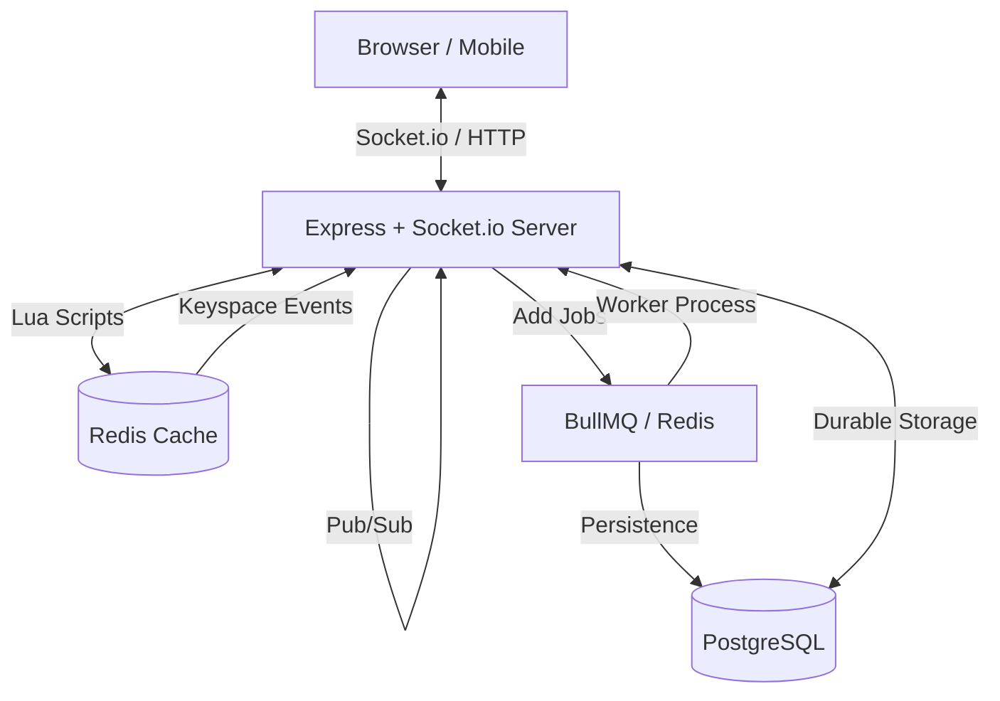

# Live Bidding Platform

A real-time auction system built with Node.js, Express, Socket.io, and React. This platform allows users to engage in live bidding with real-time updates and synchronization.

## 🚀 Live Demo
- **Frontend**: [https://live-bidding-platform-1-frontend.onrender.com](https://live-bidding-platform-1-frontend.onrender.com)
- **Backend API**: [https://live-bidding-platform-j369.onrender.com](https://live-bidding-platform-j369.onrender.com)

## 🛠 Tech Stack

### Backend
- **Core**: Node.js + Express
- **Real-time**: Socket.io for live bid updates and clock synchronization.
- **Database**: PostgreSQL (Durable storage for users, items, and bids).
- **Cache**: Redis (Authoritative source for active auction states and bid locking).
- **Background Jobs**: BullMQ for handling auction completion and expirations.
- **Authentication**: JWT-based auth.

### Frontend
- **Framework**: React.js with Vite.
- **Styling**: Tailwind CSS for a responsive and modern UI.
- **Icons**: Lucide React.
- **Networking**: Axios + Socket.io-client.

## 🏗 Architecture

The platform is designed for high concurrency and real-time synchronization using a combination of fast in-memory storage and durable persistence.



### Key Architectural Concepts

#### 1. Real-time Synchronization
- **Socket.io**: Establishes a permanent bidirectional link between clients and servers.
- **Redis Pub/Sub**: When a bid is placed on one server instance, it's published to Redis and broadcasted by all other server instances. This allows the platform to scale horizontally.

#### 2. Atomic Bid Validation (Lua)
To prevent race conditions (e.g., two users bidding the same amount simultaneously), the platform uses **Redis Lua scripts**. The entire validation logic—checking the auction status, validating the bid amount, and updating the state—happens in a single atomic operation inside Redis.

#### 3. State Management Strategy
- **Redis (Hot State)**: Stores active auction details, current highest bids, and countdowns. It is the authoritative source for live actions.
- **PostgreSQL (Durable State)**: Stores the long-term history of users, items, and bids. Data is persisted here asynchronously via background workers to keep the hot path fast.

#### 4. Background Processing (BullMQ)
Non-critical operations like updating the permanent database after a bid or processing complex auction-end logic are handled by **BullMQ** workers. This ensures that the user's connection is never blocked by slow database writes.

#### 5. Automated Auction Termination
The platform utilizes **Redis Keyspace Notifications**. When an auction's TTL expires in Redis, an event is triggered that the server listens for to automatically finalize the auction and notify the winner.

## 🏗 Project Structure
```text
live-bidding-platform/
├── backend/            # Express server and business logic
│   ├── src/            # Source code
│   ├── database/       # Migrations and seeds
│   └── docs/           # Detailed backend documentation
├── frontend/           # React/Vite application
│   └── src/            # Components, pages, and hooks
└── docker-compose.yml  # Docker orchestration for local development
```

## 🚦 Getting Started

### Prerequisites
- Docker & Docker Compose
- Node.js (v18+) & npm (if running without Docker)
- PostgreSQL & Redis (if running without Docker)

### Local Development (with Docker)
The easiest way to get started is using Docker Compose:

1. Clone the repository.
2. Initialize the backend environment variables:
   ```bash
   cp backend/.env.example backend/.env
   ```
3. Run the application:
   ```bash
   docker-compose up --build
   ```
4. Access the frontend at `http://localhost:5173` and the backend at `http://localhost:3000`.

### Manual Setup

#### Backend
```bash
cd backend
npm install
npm run migrate
npm run dev
```

#### Frontend
```bash
cd frontend
npm install
npm run dev
```

## 🧪 Testing Accounts

You can use the following credentials to test the platform:

| Role | Email | Password |
|------|-------|----------|
| Account 1 | `jenil.savalia.cd@gmail.com` | `123456` |
| Account 2 | `hari@gmail.com` | `123456` |

## 📖 Further Reading
- [Detailed Setup & Testing Guide](backend/docs/SETUP_AND_TESTING.md)
- [Backend README](backend/README.md)
- [Frontend README](frontend/README.md)

## 📝 License
This project is licensed under the MIT License.
